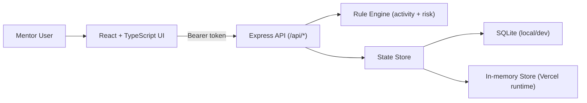

# Pathway Command Center

A cohort operations platform built for the Pathway to Research program to help one mentor manage 24 student mentees while balancing a full time job.

The project demonstrates a simple but powerful idea: many operational workflows do not need massive enterprise software. They need focused, task specific tools built around the actual job to be done. Pathway Command Center replaces scattered spreadsheets, separated documents, manual follow ups, and ad hoc reporting with one clean workspace for student tracking, assignment grading, attendance, advising notes, risk signals, and supervisor updates.

| Link | Destination |
|---|---|
| Live app | [https://ptr-tracker.vercel.app](https://ptr-tracker.vercel.app) |
| Repository | [https://github.com/dhruvtoprani/ptr-tracker](https://github.com/dhruvtoprani/ptr-tracker) |

## Why I Built This

I am mentoring a cohort of 24 students through the Pathway to Research program. Managing that cohort manually would mean jumping between spreadsheets, Word documents, emails, attendance records, grading notes, LinkedIn links, advising notes, and progress summaries.

That creates three problems.

| Problem | Product response |
|---|---|
| Student information gets fragmented across tools | Centralized student profiles with contact info, interests, notes, advising history, assignments, and attendance |
| Follow ups become reactive instead of systematic | Rule based activity scores and drop off risk levels surface students who need attention |
| Reporting to leadership takes manual synthesis | Dashboard KPIs, CSV exports, and a supervisor summary generator create reporting ready outputs |

This is not just a tracker. It is a lightweight operating system for a mentorship workflow.

## Product Goals

| Goal | How the product supports it |
|---|---|
| Reduce mentor overhead | One workspace for grading, attendance, notes, advising, and reporting |
| Improve student follow up | Activity levels and risk signals show who needs intervention |
| Make progress visible | Dashboard KPIs and charts summarize cohort health at a glance |
| Preserve context | Each student has a profile drawer with historical notes, sessions, assignments, and attendance |
| Make the project demo safe | Hide PII mode redacts names, emails, and LinkedIn identifiers for screenshots and public demos |
| Support supervisor reporting | Export suite and summary generator turn live tracking data into leadership ready updates |

## Product Tour

### Login and access control


### Command center dashboard


### Reporting panel and supervisor summary


### Student Pokedex browse view


### Individual student profile drawer


### Assignment matrix for inline grading and status updates


### Global attendance session entry


### Archive and restore workspace


### Mobile responsiveness


## Core Workflows

### 1. Manage the cohort from one dashboard

The dashboard gives a quick operating view of active students, archived students, assignment completion, attendance, no shows, advising sessions, activity distribution, and drop off risk distribution.

### 2. Browse students like an internal CRM

The Student Pokedex view lets the mentor search, filter, and drill into each student. It is designed to make student context fast to retrieve during advising, grading, and weekly check ins.

### 3. Create one assignment and apply it to everyone

Instead of manually adding the same assignment record across 24 students, the mentor creates one assignment type and the system automatically creates corresponding student level records for every active student.

### 4. Grade and update progress inline

The assignment matrix allows per student status updates, grades, feedback notes, internal notes, and revision flags without switching documents.

### 5. Log attendance globally

The attendance builder supports a default session status with per student overrides. This makes it fast to record a full cohort session while still capturing absences, late arrivals, excused absences, and no shows.

### 6. Capture advising sessions as structured history

Each student profile supports advising cards with session type, topic, goals discussed, mentor notes, action items, follow up date, and follow up completion status.

### 7. Surface risk before students disappear

The app calculates activity levels and drop off risk using assignments, attendance, advising recency, no shows, and engagement indicators. The goal is to help the mentor act before a student fully disengages.

### 8. Report progress without rebuilding the story every week

The app includes exportable JSON and CSV outputs, plus a supervisor summary generator that turns cohort data into a concise leadership update.

## Product Decisions

| Decision | Why it matters |
|---|---|
| Rule based activity scoring | Makes cohort health explainable instead of relying on vague mentor intuition |
| Drop off risk classification | Turns raw attendance and assignment data into an action queue |
| Hide PII toggle | Enables public demos and screenshots without exposing student information |
| Archive instead of delete | Preserves historical records while keeping the active workspace clean |
| Assignment matrix | Optimizes for the repeated grading workflow rather than treating each student as a separate document |
| Supervisor summary | Converts operational tracking into stakeholder communication |
| CSV and JSON exports | Keeps the tool portable and reporting friendly |

## What This Demonstrates

This project is meant to show how AI assisted development can turn a specific operational pain point into a custom internal tool quickly.

The important product signal is not simply that the app was built. The signal is that the app was scoped around a real user, a real workflow, and a real reporting burden.

| Skill area | Evidence in the product |
|---|---|
| Product discovery | Built from a real mentorship workflow with clear user pain |
| Workflow design | Consolidates tracking, grading, advising, attendance, and reporting into one system |
| Data modeling | Defines students, assignments, attendance, advising sessions, activity states, and risk states |
| Prioritization | Focuses on high leverage mentor tasks instead of adding generic features |
| Technical execution | Ships as a full stack React, TypeScript, Express, and SQLite application |
| Stakeholder communication | Includes dashboard metrics, exports, and a supervisor summary generator |
| Responsible demo design | Includes PII redaction for public sharing and screenshots |

## Current Feature Set

| Area | Capabilities |
|---|---|
| Dashboard | Active students, archived students, assignment completion, attendance rate, no shows, advising sessions, activity distribution, risk distribution |
| Student CRM | Search, filters, profile drawer, contact fields, LinkedIn URL, notes, research metadata, quick actions |
| Assignments | Global assignment creation, per student status, grade, feedback, internal notes, revision requested flag |
| Attendance | Global session creation, default status, per student overrides, attendance history |
| Advising | Structured advising cards, follow up dates, follow up completion, action items |
| Risk engine | Computed activity score, activity level, drop off risk, explanation copy, manual override support |
| Archive workflow | Archive and restore students while preserving records |
| Reporting | Supervisor summary, JSON export, student CSV, assignment CSV, attendance CSV, advising CSV |
| Demo safety | Hide PII mode for names, emails, and LinkedIn fields |

## Rule Engine

The scoring system is intentionally deterministic and explainable.

Activity score uses four signal groups.

| Signal group | Max contribution |
|---|---:|
| Assignment progress | 40 |
| Recent attendance | 35 |
| Advising engagement | 15 |
| Engagement quality | 10 |

The resulting score maps into activity levels.

| Score range | Activity level |
|---:|---|
| 85 to 100 | Excellent |
| 70 to 84 | High |
| 50 to 69 | Moderate |
| 25 to 49 | Low |
| 0 to 24 | Inactive |

Drop off risk considers missing assignments, recent absences, no shows, advising recency, activity score, archive status, and manual dropped flags.

## Tech Stack

| Layer | Tools |
|---|---|
| Frontend | React 19, TypeScript, Vite |
| UI system | Tailwind CSS, custom shadcn style primitives, Lucide icons |
| Data visualization | Recharts |
| Backend API | Express 5, Zod validation |
| Local persistence | SQLite via `better-sqlite3` |
| Vercel runtime persistence | In memory app state store |
| Auth | Username and password login with bearer token session middleware |
| Deployment | Vercel |

## Architecture



## Data Model and Seeding

| Area | Implementation |
|---|---|
| Source roster mapping | [server/seedData.ts](server/seedData.ts) |
| Shared contracts | [shared/types.ts](shared/types.ts) |
| Rule logic | [shared/rules.ts](shared/rules.ts) |
| Dashboard metrics | [shared/metrics.ts](shared/metrics.ts) |

Implementation notes:

1. `major` and `year` intentionally start blank and editable.
2. Multi email rows are normalized with MSU email preference for primary contact.
3. Shared types keep frontend, backend, and reporting logic aligned.

## Authentication

Configure environment variables:

```bash
APP_USERNAME="mentor"
APP_PASSWORD="your-password"
SESSION_TTL_SECONDS="43200"
```

When environment variables are not set, the demo defaults are:

```bash
username: mentor
password: pathway2026
```

## Local Development

```bash
npm install
npm run dev
```

| Service | URL |
|---|---|
| Frontend | `http://localhost:5173` |
| API | `http://localhost:8787` |

## Build

```bash
npm run build
```

## Deployment Notes

| Item | Detail |
|---|---|
| Vercel entrypoint | [api/index.ts](api/index.ts) |
| App server | [server/index.ts](server/index.ts) |
| Local persistent DB file | `data/pathway-command-center.db` |
| Current Vercel storage behavior | In serverless environments, file persistence is not guaranteed, so the deployed demo currently uses in memory state |

For durable production use, the next step is to connect a managed database such as Supabase, Neon Postgres, or Turso.

## Screenshot Refresh Script

Use this to regenerate all README screenshots automatically:

```bash
APP_URL="https://ptr-tracker.vercel.app" \
APP_USERNAME="<username>" \
APP_PASSWORD="<password>" \
HIDE_PII="true" \
npm run docs:screenshots
```

Screenshots are written to `docs/screenshots/`. `HIDE_PII` defaults to `true`.

## Additional Technical Docs

| Document | Purpose |
|---|---|
| [Technical Overview](docs/TECHNICAL_OVERVIEW.md) | Architecture, API surface, data model, and storage details |
| [Implementation Process Notes](TECHNICAL_PROCESS_NOTES.md) | Build process and technical implementation notes |
| [Work Log](WORK_DONE.md) | Project work history |

## Future Roadmap

| Priority | Improvement | Why it matters |
|---|---|---|
| 1 | Durable cloud database | Makes the deployed app production usable across sessions |
| 2 | Granular update endpoints | Improves reliability as the app grows beyond single mentor use |
| 3 | Rule engine unit tests | Protects the core scoring and risk logic |
| 4 | Role based access control | Supports mentors, supervisors, and admins with different permissions |
| 5 | Import workflow | Allows future cohorts to be uploaded from CSV without editing seed files |
| 6 | Follow up reminders | Turns advising action items into proactive notifications |

## One Line Summary

Pathway Command Center is a full stack cohort management platform that turns a messy mentorship workflow into a centralized operating dashboard for student progress, risk tracking, advising history, assignment management, and supervisor reporting.
