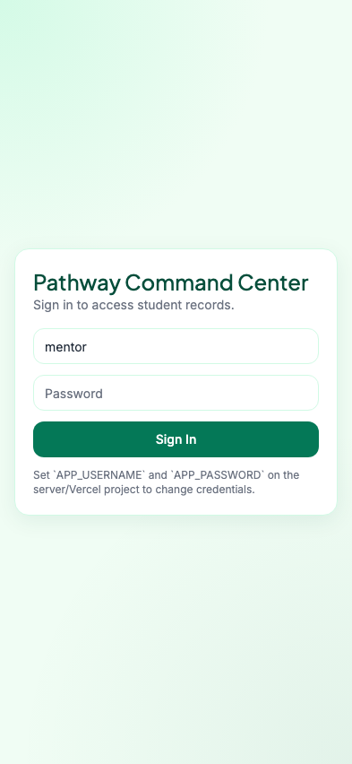
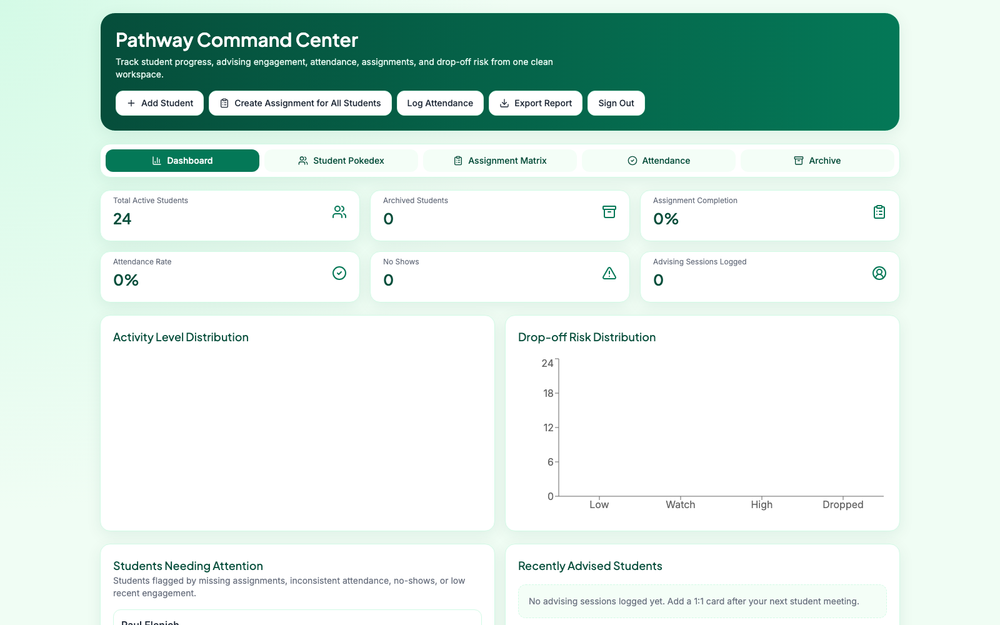
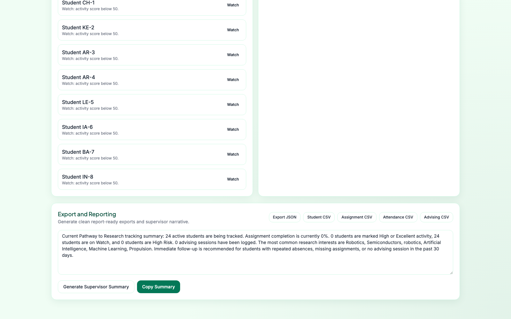
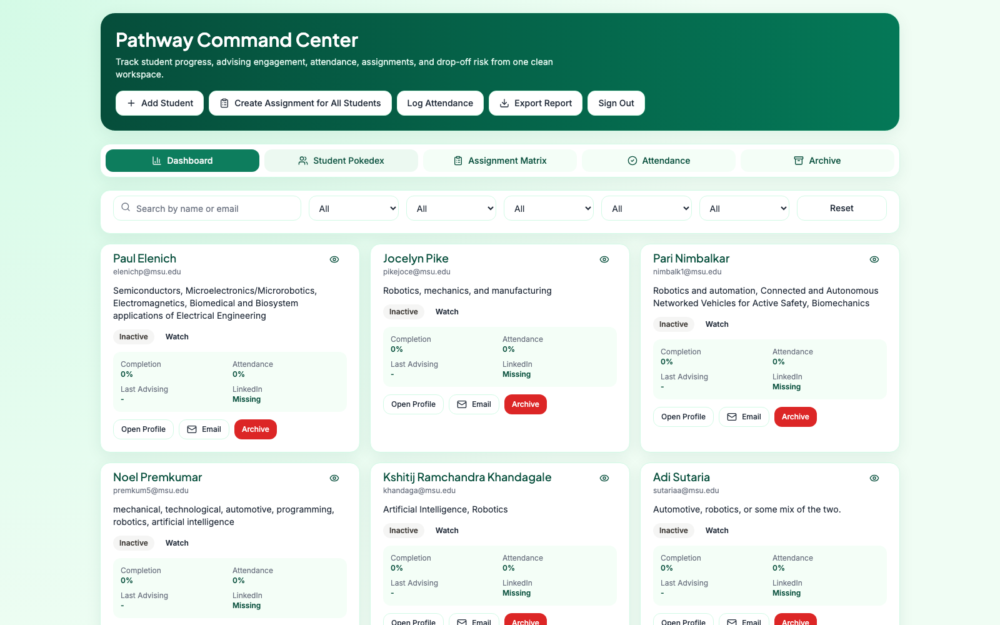
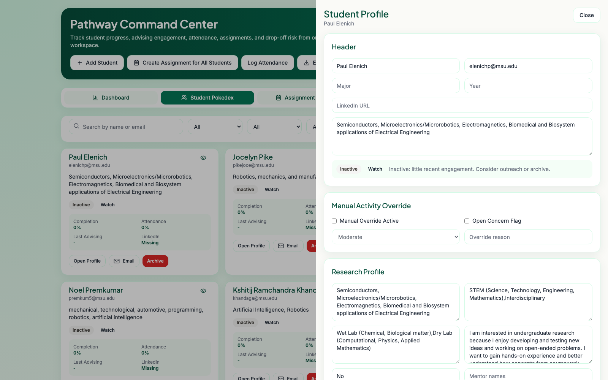
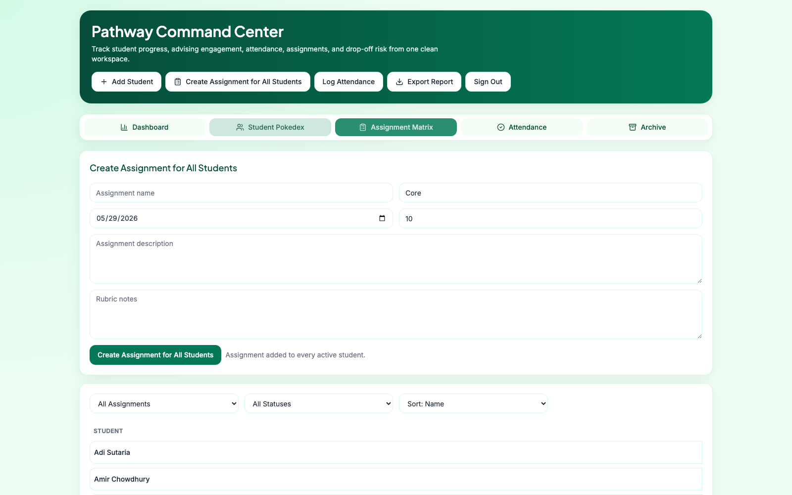
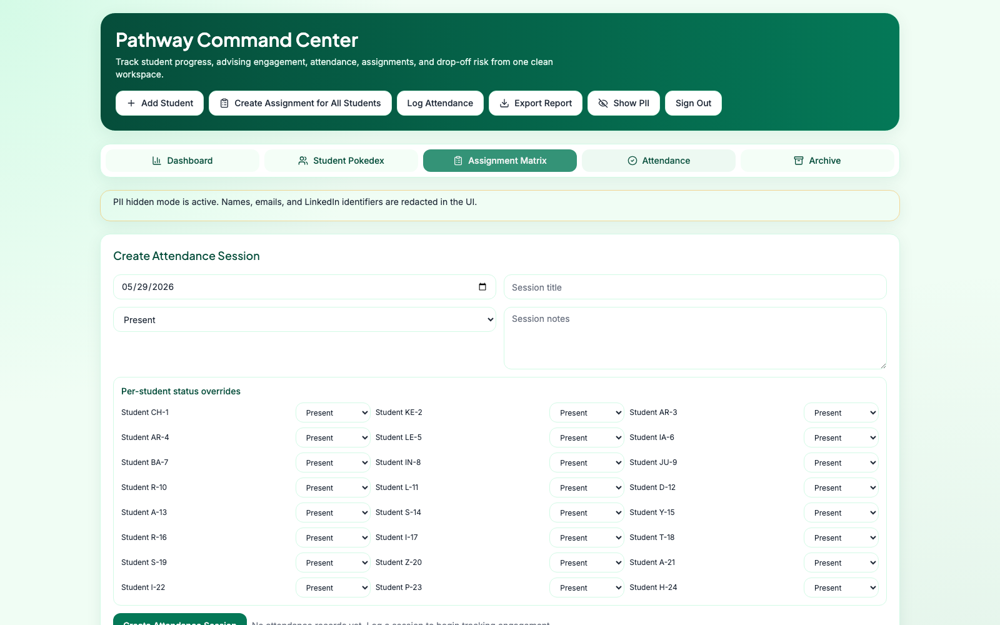
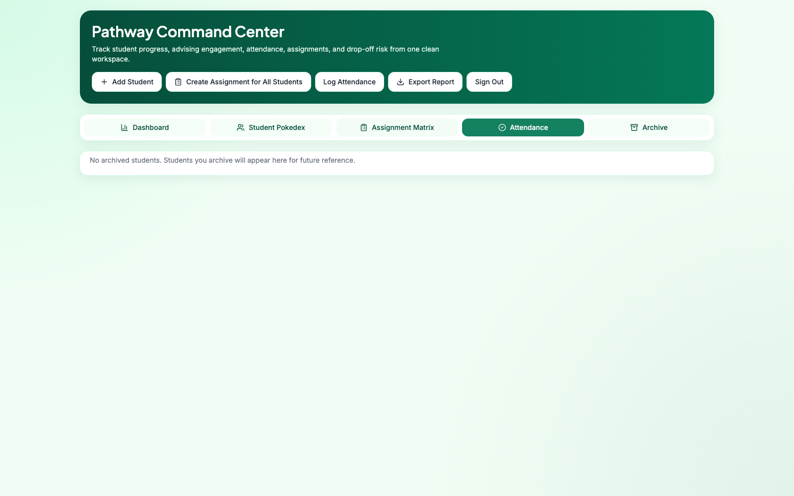
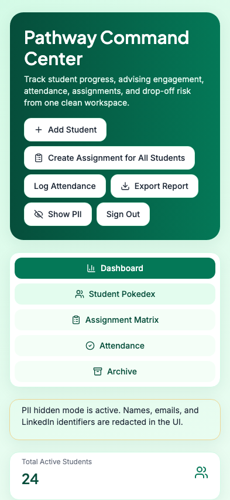
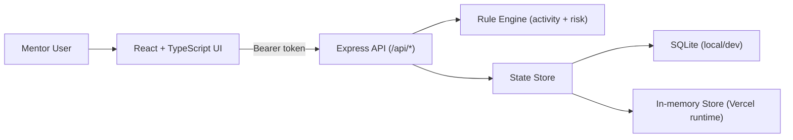

# Pathway Command Center

Pathway Command Center is a polished student operations platform for the Pathway to Research program: part CRM, part assignment tracker, part advising log, and part reporting dashboard.

- Live app: [https://ptr-tracker.vercel.app](https://ptr-tracker.vercel.app)
- Repository: [https://github.com/dhruvtoprani/ptr-tracker](https://github.com/dhruvtoprani/ptr-tracker)

## Product Tour

### Login and access control


### Command center dashboard


### Reporting panel and supervisor summary


### Student Pokedex browse view


### Individual student profile drawer


### Assignment matrix for inline grading/status updates


### Global attendance session entry


### Archive/restore workspace


### Mobile responsiveness


## Tech Stack

- Frontend: React 19, TypeScript, Vite
- UI system: Tailwind CSS, custom shadcn-style component primitives, Lucide icons
- Data visualization: Recharts
- Backend API: Express 5 + Zod validation
- Persistence (local/dev): SQLite via `better-sqlite3`
- Persistence (Vercel runtime): in-memory app state store
- Auth: username/password login with bearer-token session middleware
- Deployment: Vercel

## Architecture



## Core Features

- Dashboard KPIs for active/archived students, assignment completion, attendance, advising, and risk.
- Student Pokedex cards with filters, search, quick actions, and detail drilldown.
- Full profile drawer with advising cards, attendance history, notes, archive controls, and research profile metadata.
- `Hide PII` toggle that redacts names, emails, and LinkedIn identifiers for safe demos/screenshots.
- Global assignment creation that auto-populates assignment records for all active students.
- Assignment Matrix with per-student status, grade, and feedback inline editing.
- Attendance session builder with default status and per-student overrides.
- Rule-based activity scoring and drop-off risk classification with explanation copy.
- Archive + restore workflow that preserves full historical records.
- Export suite: JSON, student CSV, assignment CSV, attendance CSV, advising CSV.
- Supervisor summary generator for reporting to leadership.

## Data Model and Seeding

- Real student data is no longer stored in the public repo.
- Seed loading in [server/seedData.ts](server/seedData.ts) now reads from private sources only:
- `PTR_SEED_STATE_B64` (recommended for Vercel)
- `PTR_SEED_STATE_JSON`
- `PTR_SEED_STATE_FILE` (local/private file path)
- Default local private file path: `data/private/seed-state.json` (gitignored).
- If no private seed is configured, the app boots with an empty tracker.
- Shared types and contract models are in [shared/types.ts](shared/types.ts).

## Private Seed Setup

1. Export your current tracker as JSON from the app (`Export JSON`).
2. Save it locally as `data/private/seed-state.json` (this folder is gitignored).
3. Generate a Vercel-safe base64 value:

```bash
npm run seed:encode data/private/seed-state.json
```

4. In Vercel Project Settings, set `PTR_SEED_STATE_B64` to that output.
5. Redeploy, then run `/api/reset` once (or use the app reset flow) to apply the private seed.

## Authentication

- Configure environment variables: `APP_USERNAME`, `APP_PASSWORD`, and optional `SESSION_TTL_SECONDS` (default `43200`).
- Defaults when not set: username `mentor`, password `pathway2026`.
- In production/Vercel, `APP_USERNAME` and `APP_PASSWORD` are required.

## Local Development

```bash
npm install
npm run dev
```

- Frontend: `http://localhost:5173`
- API: `http://localhost:8787`

## Build

```bash
npm run build
```

## Deployment Notes

- Vercel deployment entrypoint: [api/index.ts](api/index.ts)
- App server: [server/index.ts](server/index.ts)
- Local persistent DB file: `data/pathway-command-center.db`
- In serverless environments, file persistence is not guaranteed; this project currently uses in-memory state during Vercel runtime.
- Keep student data in `PTR_SEED_STATE_B64` (private env var), not in repository files.

## Screenshot Refresh Script

Use this to regenerate all README screenshots automatically:

```bash
APP_URL="https://ptr-tracker.vercel.app" \
APP_USERNAME="<username>" \
APP_PASSWORD="<password>" \
HIDE_PII="true" \
npm run docs:screenshots
```

Screenshots are written to `docs/screenshots/`. `HIDE_PII` defaults to `true`.

## Additional Technical Docs

- [Technical Overview](docs/TECHNICAL_OVERVIEW.md)
- [Implementation Process Notes](TECHNICAL_PROCESS_NOTES.md)
- [Work Log](WORK_DONE.md)
